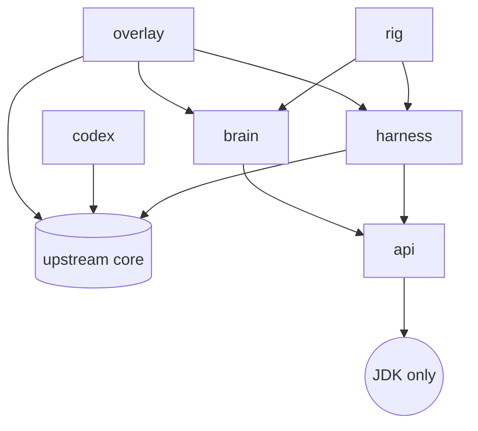

# Architecture Spine — Shatterfish

## Design Paradigm

Ports-and-adapters around one immutable value. The upstream game (`core`, `SPD-classes`) is the
outside world. Two ports face it: `Observer` (game state → `Observation`) and `ActionExecutor`
(`Action` → game input through the UI's own code paths). The Brain is a pure function
`(Observation, Belief) → (Decision, Belief')`, dependent on `api` alone. Drivers are adapters that
own a game instance and a thread: `HeadlessDriver` (E1), `EmbeddedDriver` (E5), `ReplayDriver`
(E3). The Rig and the Overlay are two callers of the same driver contract.

| Layer | Package | Holds |
|---|---|---|
| Value | `org.shatterfish.api` | `Observation`, `Action`, `Decision`, `Belief` interfaces, Run-log records, `ObservationCodec` |
| Ports | `org.shatterfish.harness` | `Observer`, `OracleObserver`, `ActionExecutor`, `RngControl`, `Snapshot`, `Profile` |
| Adapters | `org.shatterfish.harness.driver`, `org.shatterfish.overlay`, `org.shatterfish.rig` | drivers, the Panel, the runner |
| Pure | `org.shatterfish.brain` | policies, beliefs, evaluation, search |
| Knowledge | `org.shatterfish.codex`, `codex/<tag>/`, `lore/` | generated tables (JSON), Rules, Lore |

## Invariants & Rules



### AD-1 — Module boundaries and the brain wall [ADOPTED]

- **Binds:** all
- **Prevents:** a second door from game state to the bot; game types inside the Brain
- **Rule:** dependency edges exactly as the graph; `brain` → `api` only, enforced by the declared
  edges, a resolution-time check in `brain/build.gradle`, and an ArchUnit rule against
  `com.shatteredpixel..` and `com.watabou..` (ADR-0003), plus an ArchUnit rule that `brain` uses
  no `java.io`, `java.nio.file`, `java.net` or `java.lang.reflect`: the Observation is its only
  channel, so it cannot read a Run log, the salt or a Seed set. The Codex reaches the Brain as
  JSON data loaded by the caller through `api` types, never as classes and never by the Brain
  itself.

### AD-2 — One Observation type, whitelist by construction

- **Binds:** FR-3, FR-8, FR-9, FR-10, FR-23
- **Prevents:** two components serializing the world differently; a hidden field leaking by
  default
- **Rule:** the Observation is the record tree of ADR-0005; every field is something the screen,
  HUD, log or journal shows; enums have no secret members (`Tile` has no `SECRET_*`); the
  canonical binary codec in `api` is the only encoder and SHA-256 over section hashes is the
  only hash; every list has a canonical order fixed by the codec; the schema version is in the
  header and bumps on any encoding change; neither the seed, the salt, a turn counter nor any
  oracle data is a field of the Observation.

### AD-3 — The Observer reads drawing predicates only

- **Binds:** FR-3, FR-8, FR-10, FR-11
- **Prevents:** an Observer that recomputes visibility or reads model fields the renderer does not
- **Rule:** the per-rule table of ADR-0006 is the whitelist; each row cites the game line the
  renderer uses and has a leak test; the Observer runs only at an Input wait (hero ready, no
  `Window`) on the scene-owning thread; `OracleObserver` is the only extension and is refused
  by the Rig.

### AD-4 — Actions go through the UI's code paths

- **Binds:** FR-4, FR-40
- **Prevents:** a second way to move the hero that the game's own guards do not see
- **Rule:** `ActionExecutor` dispatches exactly what a click, key or button would (`Hero.handle`,
  `Item.execute`, `Hero.rest`, `Hero.search`, window buttons), on the UI-role thread
  (ADR-0013); it validates against the Observation's `actions` section before touching state and
  rejects with a reason; the valid-Action set is computed from the Observation alone.

### AD-5 — An Input wait is the unit of everything

- **Binds:** FR-2, FR-23, FR-27, FR-39, FR-40
- **Prevents:** drivers that disagree on when a turn starts; Run logs and Decisions that cannot
  be aligned
- **Rule:** an Input wait is "hero ready and either no `Window` or a recognised Prompt window"
  (`docs/rules/game-loop.md`);
  exactly one Observation, one Decision, one Action, one Run-log record and one RNG reseed happen
  per Input wait; the wait index `k` is the primary key across all of them; the Run log, not the
  Observation, records the turn as `Statistics.duration + Actor.now()` in fixed-point thousandths.

### AD-6 — Determinism is owned by the Harness

- **Binds:** FR-2, FR-6, FR-24, NFR-2
- **Prevents:** a Run whose outcome depends on the machine, the profile, or the draw count
- **Rule:** ADR-0007: the seed is the game's seed and the Run is a seeded game; the Run tuple is
  (tag, class, challenges, seed, salt, Action list) with the salt drawn by the runner, logged,
  and never observed; the Harness reseeds the base generator from `mix(salt, k)` at every Input
  wait after `Dungeon.init`; every Run starts in a fresh versioned standard Profile (English,
  intro off, all guide pages read, no bones, badges or rankings) in its own working directory;
  one process hosts one Run; identity-hash order is removed by the identity-order hook row and
  render-thread draws by the routing hook row. The determinism test runs in two JVMs.

### AD-7 — The Brain is a pure function

- **Binds:** FR-27, FR-28, FR-32, FR-33, NFR-4
- **Prevents:** a Brain that remembers what it did instead of what it saw; a Brain that cannot
  be handed a human's turn
- **Rule:** `Brain.decide(Observation, Belief) → (Decision, Belief)`, deterministic given its own
  generator seeded by the caller from `mix(salt, k)`; it holds no game object and no thread; state lives only
  in the returned `Belief`, which is an `api` value serialized into the Run log; the Overlay's
  thinking budget delays a Decision and never changes it.

### AD-8 — Threads: game-actor, UI-role, brain-worker

- **Binds:** FR-12, FR-38, NFR-4
- **Prevents:** the 2020-style deadlock between render and actor threads; a Panel drawn from the
  wrong thread
- **Rule:** the game's actor thread is never touched by Shatterfish code; the UI-role thread
  (the render thread in the Overlay, the driver thread headless) is the only one that observes,
  executes Actions and writes the Panel; the Brain runs on its own worker with an immutable
  Observation; Observer and ActionExecutor assert the UI-role thread on entry. Detail and
  hand-off rules: ADR-0013.

### AD-9 — Hidden state never enters a rollout

- **Binds:** FR-6, FR-13, FR-34
- **Prevents:** a Search that peeks
- **Rule:** any simulation the Brain uses is either an abstract model built from the Observation
  and Belief in `brain`, or a redetermined `Snapshot` produced by `harness` from a Belief sample,
  whose Observation is proven equal to the original by the differential test; `Snapshot` and
  `Redeterminer` interfaces are declared in E1 and implemented in E6 (ADR-0009, ADR-0010).

### AD-10 — Hooks are one-line, registered, counted

- **Binds:** all code under upstream directories
- **Prevents:** silent upstream edits; a merge that drops one
- **Rule:** ADR-0008: a hook site is one line calling a nullable listener in
  `…/shatterfish/Hooks.java` (or a semantically neutral one-line edit), carries the marker
  `// shatterfish-hook:<id>`, and has a row in `docs/UPSTREAM.md`; a test counts markers against
  rows; the v1 budget is eight.

### AD-11 — Every published number is a Registration plus a Run log

- **Binds:** FR-19 to FR-26, NFR-2
- **Prevents:** a Results page that cannot be reproduced
- **Rule:** a comparison runs only under a committed Registration (Hypothesis id, bounds, Seed
  set version, both Brains' commits); every Run writes a JSONL log with a hash chain (ADR-0011);
  the Sequential test is the Per-pair GSPRT of ADR-0012; Oracle mode is refused by the runner;
  the Results page carries the command that reproduces it.

### AD-12 — The Overlay is an instrument built from the game's toolkit

- **Binds:** FR-37 to FR-47, NFR-6
- **Prevents:** a second UI toolkit; an Overlay that edits the HUD
- **Rule:** the Panel is a Noosa `Component` using `Chrome`, `renderTextBlock`, `RedButton`,
  `Icons`, `ScrollPane`, added to the scene through the `GameScene` seam hook, placed per
  `DESIGN.md` Layout; it reads only Observations and Decisions; hotkeys are `SPDAction`s with
  defaults F6 to F11; the launcher owns the Profile and the oracle flag.

## Consistency Conventions

| Concern | Convention |
|---|---|
| Naming | Glossary terms are class names: `Observation`, `Action`, `Decision`, `Belief`, `Policy`, `Goal`, `SafetyFlag`, `RunLog`, `Registration`, `SeedSet`; packages `org.shatterfish.<module>`; test classes end in `Test`, leak tests in `LeakTest` |
| Identifiers | Input wait index `k` (0-based, long); Run id = `<tag>-<class>-<challenges>-<seedcode>-<salt>`; Hypothesis id = `H-<yyyymmdd>-<slug>`; schema version = int in `Observation.header` |
| Data and formats | `api` values are Java records; canonical binary for hashing (ADR-0005); JSONL for Run logs (ADR-0011); JSON for the Codex; no floats in hashed data (integer pairs); UTF-8 everywhere; times in ISO-8601 UTC only in Results metadata, never in hashed data |
| Errors | The Brain throwing produces `Decision.wait` with the exception class in the Run log and the Panel (EXPERIENCE.md "Brain error"); the game never crashes because of the Brain; an invalid Action is rejected with a `Reason` value, never an exception |
| Logging | Shatterfish code logs through `java.util.logging` with the module as logger name; game log lines are data (part of the Observation), never re-logged |
| Config | Launcher flags and Rig CLI (`--brain --baseline --seeds --parallel --out --oracle`); no config files besides Seed sets and Registrations, which are committed |
| Threads | Every public method of `Observer`, `ActionExecutor` and the Panel starts with a thread assertion (AD-8) |
| Determinism | Every generator used by Shatterfish code is seeded from `mix(salt, k)`; `HashMap`/`HashSet` iteration never decides an outcome in Shatterfish code (use `LinkedHashMap`, sorted keys, or lists) |

## Stack

| Name | Version |
|---|---|
| Java | 21 (Shatterfish modules; upstream compiles for 11) |
| Gradle | 9.4 (wrapper) |
| libGDX (upstream) | 1.14.0, `gdx-backend-headless` + `gdx-platform:natives-desktop` for the Harness |
| JUnit | 5.11.4 |
| ArchUnit | 1.3.0 (bump to 1.5.0 in E1 after a web check of the current release) |
| Statistics | hand-ported GSPRT in `rig`, no library |
| Docs | MkDocs Material per `docs/requirements.txt` |

## Structural Seed

```text
shatterfish/
  api/       org.shatterfish.api          # Observation, Action, Decision, Belief, RunLog records, ObservationCodec, JsonWriter
  harness/   org.shatterfish.harness      # Observer, OracleObserver, ActionExecutor, RngControl, Profile, Snapshot, Redeterminer
             org.shatterfish.harness.scene    # HeadlessScene (harness-owned Scene), no-op GL, Pixmap atlases
             org.shatterfish.harness.driver   # HeadlessDriver, ReplayDriver, the driver contract
             src/test  fairness suite: LeakTest per ADR-0006 row, DifferentialTest, ToggleTest, DeterminismTest (two JVMs), HooksTest
  codex/     org.shatterfish.codex        # generators per table, completeness check, citation checker, vocabulary diff
  brain/     org.shatterfish.brain        # Brain (pure), Beliefs, Policies, Arbitration, Evaluation, safeTest; search/ reserved
  rig/       org.shatterfish.rig          # Runner (process per Run), SeedSets, Registration, Gsprt, Results, Replay
  overlay/   org.shatterfish.overlay      # ShatterfishLauncher, EmbeddedDriver, Panel and components, SPDActions
core/src/main/java/com/shatteredpixel/shatteredpixeldungeon/shatterfish/Hooks.java   # the registry (hook #2)
codex/<tag>/*.json         # generated, CI-checked
docs/rules/, docs/adr/, docs/UPSTREAM.md
```

```mermaid
sequenceDiagram
  participant A as game actor thread
  participant U as UI-role thread (driver or render)
  participant B as brain worker
  A->>A: Hero.act() with no curAction: ready(), returns false, parks
  U->>U: Input wait k detected (hero.ready, no Window)
  U->>U: RngControl.reseed(salt, k); obs = Observer.observe()
  U->>B: decide(obs, belief)
  B-->>U: Decision (or wait after budget, Overlay only)
  U->>U: ActionExecutor.execute(decision.action) via Hero.handle / Item.execute
  U->>A: hero.next() wakes the actor thread
  A->>A: actors run until the hero parks again
```

## Capability → Architecture Map

| Capability / Area | Lives in | Governed by |
|---|---|---|
| 4.1 Headless engine (FR-1..FR-6) | `harness` (`scene`, `driver`, `Observer`, `ActionExecutor`, `RngControl`, `Snapshot`) | AD-2..AD-6, AD-9 |
| 4.2 Fairness (FR-7..FR-13) | `harness/src/test`, `brain/build.gradle`, ArchUnit in `api` and `brain` | AD-1, AD-3, AD-8, AD-9 |
| 4.3 Codex and knowledge (FR-14..FR-18) | `codex`, `codex/<tag>/`, `docs/rules/`, `lore/` | AD-1 (data only), conventions |
| 4.4 Rig (FR-19..FR-26) | `rig` | AD-6, AD-11 |
| 4.5 Brain (FR-27..FR-36) | `brain` | AD-7, AD-9 |
| 4.6 Overlay (FR-37..FR-47) | `overlay`, hooks 3, 7, 8 | AD-4, AD-8, AD-10, AD-12 |
| 4.7 Program and upstream (FR-48..FR-53) | `docs/`, `.github/`, `.claude/` | AD-10, ADR-0002, ADR-0004 |

## Deferred

| Decision | Why it can wait | Revisit |
|---|---|---|
| Snapshot/restore and redetermination mechanism (bundle rewrite vs belief-built world) | interfaces reserved by AD-9; no caller before E6 | ADR-0009 (session 12) fixes the interface and the E6 default |
| Abstract tactical model vs engine rollouts | must be measured (simulator speed, Long et al. properties) | ADR-0010 (session 12) states the criteria; E6 decides |
| Run-log record fields beyond the header, hash chain and Decision | ADR-0011 (session 12) | |
| GSPRT bounds, burn-in, calibration | ADR-0012 (session 12) fixes the statistic; E3 calibrates on the rig's own distribution | |
| Overlay hand-off details (Take over mid-animation, THINKING queueing) | ADR-0013 (session 12) | |
| Classloader isolation (several Runs per JVM) | process per Run is the default; the E1 spike measures | E1 spike report |
| Codex generation mechanics (reflection per table, measured combat tables) | E2 stories; no cross-module divergence risk | E2 |
| Learned components | optional E9; annual review of the learned frontier | 2027 |
