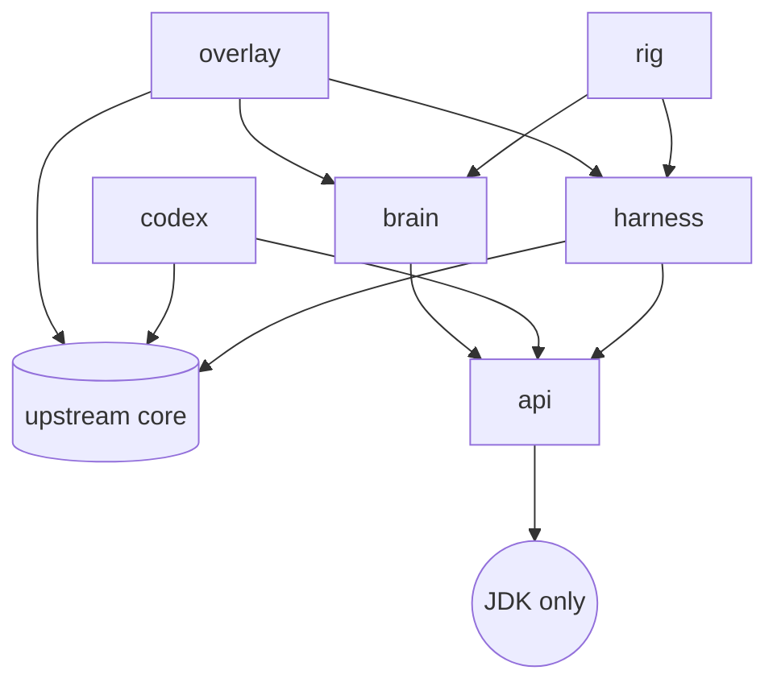

# Architecture

!!! note "Placeholder"
    The BMAD architecture document (bootstrap sessions 11-12) becomes the authoritative
    description once the product owner approves it; this page will then point at it under
    [BMAD artifacts](bmad/index.md) and keep only the module map. Until then the module map
    below and [ADR-0003](adr/0003-module-layout.md) are what exists.

## Modules

Shatterfish adds six Gradle modules beside upstream's, all under `shatterfish/`, package root
`org.shatterfish`. The arrows are the only permitted dependency edges; the build fails on any
other.

| Module | May depend on | Contents |
|---|---|---|
| `api` | nothing | DTOs only: `Observation`, `Action`, `Belief`, `Decision`, run-log records, the `JsonWriter` they share; and ADR-0009's reserved half, `SnapshotHandle`, `RolloutResult`, `BeliefSample`, the `BeliefSampler` interface, and `Simulator` and `Redeterminer`, two abstract classes whose final methods hold the scrubbed contract (story 1.20) |
| `harness` | `core`, `api` | `Observer` (the only class allowed to read game state into the bot), `ActionExecutor` (the only class that drives the hero), RNG control, snapshot/restore, redetermination, `HeadlessBoot` (the backend, the no-op graphics binding, the virtual display `HeadlessGraphics` reports so that text renders, in-memory settings), `HeadlessScene` (the game's own scene, constructed without a graphics context) and `SceneStepper` (one fenced frame at a time), `HeadlessDriver` (owns a Run in `org.shatterfish.harness.driver`: starts a seeded game the way a player does and steps it to each Input wait, a death or a requested scene change), `UiRole` (the thread that observes and executes, claimed by the driver that starts a Run and asserted by the Observer and the executor on entry, story 1.19), `SnapshotStore` (a Run's exact state at a wait, the game's own save held in memory and put back through its own load, handed out as an opaque `SnapshotHandle`, story 1.20), `Launcher` (the harness command line: a seed, `--oracle` and `--benchmark`, the only place an `OracleObserver` is constructed; its nested `Benchmark` measures the E1 numbers and reads the sidecar under `--oracle`, story 1.21), `OracleObserver` and `OracleView` (the marked read and its sidecar, story 1.18), `EmbeddedDriver` |
| `codex` | `core`, `api` | The Codex generator (`Generate`, one task with no Run, ADR-0017): every mob, item, generator table, mob rotation, trap, recipe and changelog entry as `api` records written as canonical JSON to `codex/<tag>/*.json`, each entry cited to the `path:line` read from the pinned source at generation (`Citations`); `CodexSeedFreeTest` and `CodexLeakTest` hold that no value derives from a seed, a Profile or a Run (story 2.1); the vocabulary diff against a second pinned game, read and never built (story 2.8); the site's Codex pages rendered from that same text by the same task (`Pages`, story 2.9), held against the committed folder by the same drift check and against `mkdocs.yml`'s nav by `CodexDocsTest`; the citation checker as E2 adds it. The harness is on its test classpath only, for the leak test's live Run |
| `brain` | `api` only | Beliefs, scripted policies, tactical search, strategic playbooks, evaluation. Identical code runs headless and in the overlay |
| `rig` | `harness`, `brain` | Parallel runner, seed sets, statistics, SPRT, JSONL run logs, replay |
| `overlay` | `core`, `harness`, `brain` | The in-game UI and `ShatterfishLauncher` |

## Invariants that will not change

- The brain re-plans from the current `Observation` every turn and never assumes it made the
  previous move. This is what makes human takeover in the overlay work without desync.
- Search never sees hidden state: either an abstract tactical model built from the Observation
  and beliefs, or engine rollouts with redetermination (re-sample everything hidden before each
  rollout). Rollouts on the raw saved game are forbidden.
- A run is fully determined by (upstream tag, seed, action list).
- The overlay uses the game's own toolkit only.

See [Fairness](fairness.md) for how the first two are tested and [Glossary](glossary.md) for the
terms.
