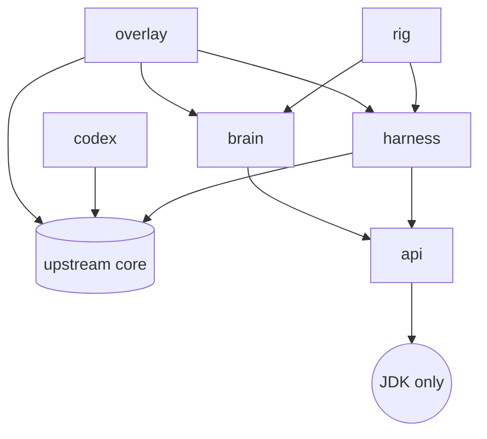

# Architecture

!!! note "Placeholder"
    The BMAD architecture document (bootstrap sessions 11-12) becomes the authoritative
    description once the product owner approves it; this page will then point at it under
    [BMAD artifacts](bmad/index.md) and keep only the module map. Until then the module map
    below and [ADR-0003](adr/0003-module-layout.md) are what exists.

## Modules

Shatterfish adds six Gradle modules beside upstream's, all under `shatterfish/`, package root
`org.shatterfish`. The arrows are the only permitted dependency edges; the build fails on any
other.

| Module | May depend on | Contents |
|---|---|---|
| `api` | nothing | DTOs only: `Observation`, `Action`, `Decision`, run-log records |
| `harness` | `core`, `api` | `Observer` (the only class allowed to read game state into the bot), `ActionExecutor` (the only class that drives the hero), RNG control, snapshot/restore, redetermination, `HeadlessDriver`, `EmbeddedDriver` |
| `codex` | `core` | Reflection dump of every mob, item, generator table, mob rotation, trap, recipe, and changelog entry, parameterised by depth and challenges; writes `codex/<tag>/*.json` and generated docs |
| `brain` | `api` only | Beliefs, scripted policies, tactical search, strategic playbooks, evaluation. Identical code runs headless and in the overlay |
| `rig` | `harness`, `brain` | Parallel runner, seed sets, statistics, SPRT, JSONL run logs, replay |
| `overlay` | `core`, `harness`, `brain` | The in-game UI and `ShatterfishLauncher` |

## Invariants that will not change

- The brain re-plans from the current `Observation` every turn and never assumes it made the
  previous move. This is what makes human takeover in the overlay work without desync.
- Search never sees hidden state: either an abstract tactical model built from the Observation
  and beliefs, or engine rollouts with redetermination (re-sample everything hidden before each
  rollout). Rollouts on the raw saved game are forbidden.
- A run is fully determined by (upstream tag, seed, action list).
- The overlay uses the game's own toolkit only.

See [Fairness](fairness.md) for how the first two are tested and [Glossary](glossary.md) for the
terms.
