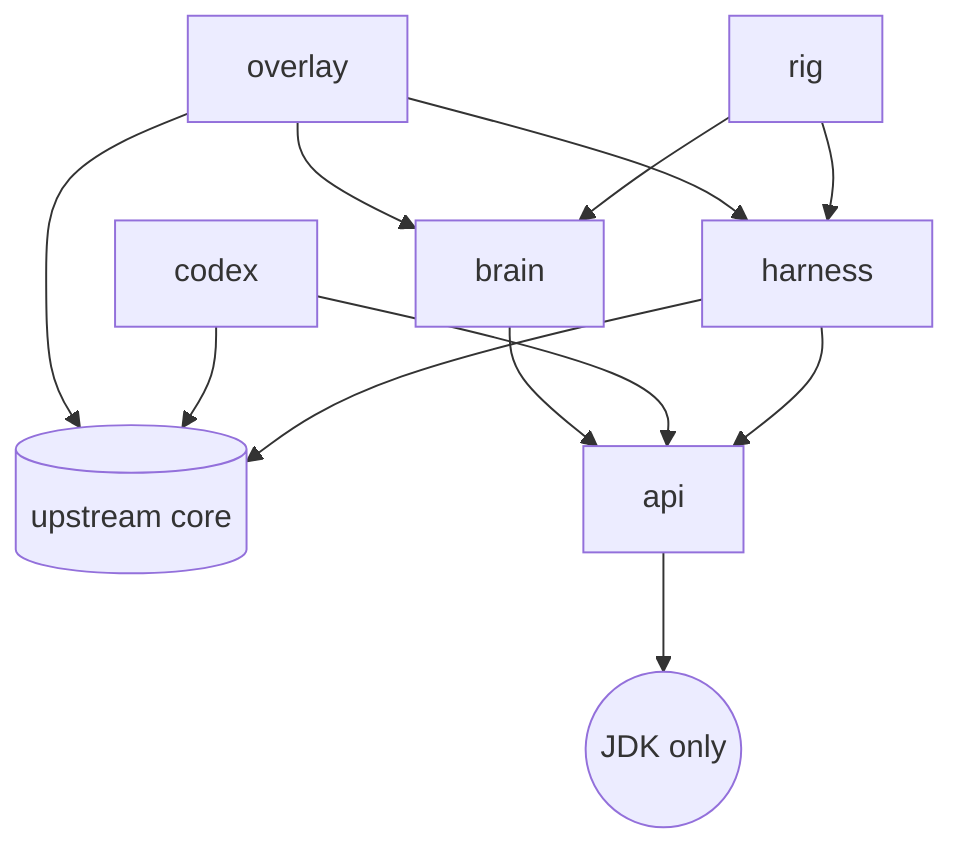

# Architecture

!!! note "Placeholder"
    The BMAD architecture document (bootstrap sessions 11-12) becomes the authoritative
    description once the product owner approves it; this page will then point at it under
    [BMAD artifacts](bmad/index.md) and keep only the module map. Until then the module map
    below and [ADR-0003](adr/0003-module-layout.md) are what exists.

## Modules

Shatterfish adds six Gradle modules beside upstream's, all under `shatterfish/`, package root
`org.shatterfish`. The arrows are the only permitted dependency edges; the build fails on any
other.

| Module | May depend on | Contents |
|---|---|---|
| `api` | nothing | DTOs only: `Observation`, `Action`, `Belief`, `Decision`, run-log records, the `JsonWriter` they share; and ADR-0009's reserved half, `SnapshotHandle`, `RolloutResult`, `BeliefSample`, the `BeliefSampler` interface, and `Simulator` and `Redeterminer`, two abstract classes whose final methods hold the scrubbed contract (story 1.20) |
| `harness` | `core`, `api` (the brain on its test classpath only, story 4.11) | `Observer` (the only class allowed to read game state into the bot), `ActionExecutor` (the only class that drives the hero), RNG control, snapshot/restore, redetermination, `HeadlessBoot` (the backend, the no-op graphics binding, the virtual display `HeadlessGraphics` reports so that text renders, in-memory settings), `HeadlessScene` (the game's own scene, constructed without a graphics context) and `SceneStepper` (one fenced frame at a time), `HeadlessDriver` (owns a Run in `org.shatterfish.harness.driver`: starts a seeded game the way a player does and steps it to each Input wait, a death or a requested scene change), `UiRole` (the thread that observes and executes, claimed by the driver that starts a Run and asserted by the Observer and the executor on entry, story 1.19), `SnapshotStore` (a Run's exact state at a wait, the game's own save held in memory and put back through its own load, handed out as an opaque `SnapshotHandle`, story 1.20), `Launcher` (the harness command line: a seed, `--oracle` and `--benchmark`, the only place an `OracleObserver` is constructed; its nested `Benchmark` measures the E1 numbers and reads the sidecar under `--oracle`, story 1.21), `OracleObserver` and `OracleView` (the marked read and its sidecar, story 1.18), `EmbeddedDriver` Since story 5.1: `EmbeddedRun`, the Run loop turned inside out for a game whose loop the render thread owns: once per frame it asks `WaitGate` (the Input-wait confirmation both drivers share, extracted from `HeadlessDriver`) whether a wait is new, reseeds and observes at one, hands the Observation to the Brain's own worker thread, and executes and records the answer through the headless loop's executor and record writer at a later frame, never waiting on the worker; it re-attaches at every play scene through hook row 3's seam, keeping the wait index, salt, Belief and log. `NewGame` begins a Run's game for both drivers. |
| `codex` | `core`, `api` | The Codex generator (`Generate`, one task with no Run, ADR-0017): every mob, item, generator table, mob rotation, trap, recipe and changelog entry as `api` records written as canonical JSON to `codex/<tag>/*.json`, each entry cited to the `path:line` read from the pinned source at generation (`Citations`); `CodexSeedFreeTest` and `CodexLeakTest` hold that no value derives from a seed, a Profile or a Run (story 2.1); the vocabulary diff against a second pinned game, read and never built (story 2.8); the site's Codex pages rendered from that same text by the same task (`Pages`, story 2.9), held against the committed folder by the same drift check and against `mkdocs.yml`'s nav by `CodexDocsTest`; the citation checker as E2 adds it. The harness is on its test classpath only, for the leak test's live Run |
| `brain` | `api` only | Beliefs, scripted policies, tactical search, strategic playbooks, evaluation. Identical code runs headless and in the overlay. Since story 4.1: `Brain` (arbitration over a priority list of `Policy`s, re-planned from each Observation), `Memory` (the Belief's bytes: what was seen, never what was intended), `Stream` (the Brain's own SplitMix64 randomness), and `BrainDecider`, the `api` `Deliberator` the Run loop drives and logs the Decision and Belief hash of. The rig names it `shatterfish`. Since story 4.2 it is built on `Codex.Knowledge` (the identifiable families by deck weight, the items special rooms place, the guaranteed drops), which the rig reads from `codex/<tag>/` (`CodexKnowledge`), and `Beliefs` holds what it believes: candidate identities per unidentified appearance, floor facts, the guaranteed drops a set of floors still owes, and enemies remembered out of sight. Since story 4.4: a `Policy` ranks what it would do, and its next ranks are the Decision's alternatives; `Safety` (the Decision's flags, read off the screen); `Highlights` (the cells the chosen Action points at, handed over through `Deliberator.lastHighlights` into the wait record) Since story 4.5: `Evaluation`, one scoring function, a weighted integer sum of features the Observation shows (position features: hit points, depth, level, strength, hunger, enemies in view; action features: resting while hurt, attacking, descending, searching, waiting), with its weights an `api` `Weights` value the rig reads from `weights/<brain>.json` and hands over at construction; the fallback Policy draws uniformly among the offered Actions that score highest Since story 4.6: `Explore`, the first Policy that changes play: one Step per wait toward the nearest frontier over the cells a click steps onto (never a transition, a chest, an armed trap, the chasm or the well), then a bounded round of searches from cells beside a wall, each spot once; `Memory` (version 3) records where the hero has been seen standing still, and each Policy draws from a stream keyed on its name Since story 4.3: `SafeTest`, the worst-case check on trying an unidentified potion, scroll or wand where the hero stands, over the candidate identities, the cell's water, the enemies in view and the hero's hit points; a lethal worst case, or a disabling one beside an enemy, is refused whatever the mean. Since story 4.7: `Fight`, above `Explore` while an enemy is in view: it attacks when the fight is favourable by the Codex's combat figures (`Codex.Threat`, `Codex.Gear`, read by `CodexKnowledge` from `mobs.json`, `combat.json` and `strings.json`), takes the cell fewest enemies can engage when several are coming, and retreats otherwise, by the stairs only while the floor is not sealed Since story 4.8: `Pickup` and `Equip`, below `fight` and above `explore`, which stay out while an enemy is in view: `Pickup` takes an item worth the turns to reach it, reading the Beliefs for an unidentified one, remembers a heap the game would not let it take (`Memory.refused`, read against the pack and its own aim on the screen before) and blocks its own refused Step; `Equip` puts on a plain weapon or armour the Evaluation prefers, after the strength it asks and a hidden curse's chance, never one whose worst case `SafeTest` calls unsurvivable, matching names with the fight Policy's `Fight.measured`, on the Codex's gear (`Codex.Gear` with the item table's tier and strength) and the Evaluation's item, gold, turn, weapon, armour and curse weights. Since story 4.9: `Heal`, above `Fight`, drinks an identified potion of healing when the hero's hit points are at or under the damage the enemies in view are expected to deal before the fight is over (the fight Policy's threat estimate), one potion at a time (`Memory` version 5 records the wait of the last drink); `Eat`, below `Fight` and above `Explore`, on calm screens eats at the hungry icon a food of at most 300 energy and at the starving icon the food that wastes least, from a cited table of food energies by shown name, and the fallback never eats Since story 4.10: `TestItem`, the first Policy on a calm screen: it drinks or reads the unidentified potion or scroll worth most to know (copies held times candidates left), a potion only at half health or below when healing holds at least a fifth of its odds and its worst case leaves a quarter of the hit points, walking up to eight Steps first to a cell that makes the worst case smaller (water against liquid flame, a door with a way through against toxic gas); a scroll only at full health and while the item-picker scrolls hold under a quarter of its odds, read plainly; for twelve waits after a test it steps out of its own fire or gas, through the credited door, and then rests toward full health; a test the next screen shows was not carried out is balked at for the floor. `Memory` version 7 adds `drank` (story 4.9) and `trial`, `balked`, `walking`, `tested`, `clouds` and `refuge`: the clouds are the cells seen showing fire or a harmful gas, which `Explore.walkable` keeps every walking Policy off until they are seen clear. Answer-prompt declines item confirmations but the scroll's cancel. The fallback no longer draws item uses while anything else is offered. Since story 4.12: `Descend`, between equip and explore, owns the way down: it leaves a floor when it is spent (`Explore.spent`: no reachable frontier and no search worth making), when the hero is hungry with no food held, or when the waits on the floor reach an allowance of 500 waits and 250 more per guaranteed drop still expected on it (owed in the set, over the floors left in it); it walks to the cell beside the open regular exit, rests there to full health unless starving (at most 20 rests a floor), then takes the Step onto the exit, which travels; never on a sealed floor. With no exit seen it searches on past explore's budget. It stands aside for explore's owed rest and its step out of an avoided region. The fight Policy's retreat never flees down onto a boss floor, nor down hurt while the descend Policy is leaving. The explore Policy no longer descends. `Memory` version 8 adds `arrived`, `rests`, `stepped` (the cell of the last Step handed over), `tried` and `fleeting`: two refusals aimed at one cell block it, for the floor on a calm screen and for 100 waits with an enemy in view, and no refusal counts while the hero shows rooted or vertigo; while rooted the Brain offers itself no Step and no stairs. Since story 4.11: `Answers`, the prompt Policy's rules by Prompt kind, one per kind through an exhaustive switch (a subclass by the class, a shop and the spell list left, the upgrade confirmed, a stone of intuition's guess made from the Beliefs, story 4.1's rule for the rest); a Prompt its rule cannot answer throws `Answers.BrainError` (an `api` `Decider.CannotDecide`, the one exception the Run loop ends on, as `BRAIN_ERROR`, with the message in the log's `end` record); `Memory` version 9 carries the windows (the last Action and its item, the Action that opened the window open now, and the openers of windows left, shunned on their floor), and the Run loop stops a Run that goes a hundred waits without a turn as `STALLED`. |
| `rig` | `harness`, `brain`, `api` | Parallel runner, statistics, SPRT, JSONL run logs, replay; the five committed Seed sets and the one task that writes them (`SeedSets`, `Seeds`, one command with no Run, ADR-0018): every triple derived from the set's own name and the triple's index through the published mix function, so a stranger can reproduce a set rather than download it, and `SeedSetsTest` holds the committed bytes against a fresh derivation. `load` refuses the `holdout` set to a development read and `publish` takes the reason it is being opened (FR-20) |
| `overlay` | `core`, `harness`, `brain`, `desktop` (story 5.1) | The in-game UI and `ShatterfishLauncher`. Since story 5.1: `ShatterfishLauncher` (`:overlay:launch`) starts upstream's desktop game in a Run Profile it owns (`Profile.owned`: its own directory and in-memory settings, never the player's; a used directory is refused, FR-37; the directory is claimed by creating `.shatterfish-owner` in it, and a directory named with `--profile` keeps that file after the Run, so it serves one Run only; a directory the launcher made is deleted at the close, and by a shutdown hook if the game dies without closing) with a Run attached; `OverlayGame` is upstream's `ShatteredPixelDungeon` with `create`, `render` and `dispose` extended at their edges: the Run's game begins through the headless driver's own body (`NewGame.begin`) and the harness's `EmbeddedRun` is handed one frame at a time on the render thread, its UI-role thread; `OverlayApplication` is libGDX's desktop backend with the render queue counted, which the Run's wait confirmation needs. The oracle is made only by the launcher's `--oracle`, marked in the window title and the log header. The Overlay plays the random agent or, with `--agent brain`, the Brain on the committed weights and an empty Codex until the Codex reader moves out of the rig; its logs say `driver: embedded` and the Rig refuses them. Since story 5.2: the Panel, docked at the right edge of the dungeon view: `PanelLayout` places it as a pure function of the screen (left of the inventory pane or the tag column, below the menu pane and the boss bar, above the toolbar and the status pane; 200 UI pixels wide, down to 160 to keep 200 of map, and collapsed to the Mode strip below that, below 200 of view height, in the mobile layout or at the human's toggle), `Panel` draws it with the game's `TOAST_TR_HEAVY` and `TOAST_TR` nine-patches only, and `PanelDock`, run inside `OverlayGame.update()` (the game's update in the game's order) between the scene's update and the cameras' matrices, keeps it on each play scene, behind the scene's fade and dimmed under the game's prompt and badge banners, and sets the world camera's horizontal offset so the hero is drawn at the middle of the uncovered map in the same frame the play scene's own layout pass reset it. An oracle Run's Mode strip carries an ORACLE label, and an oracle Run opens windowed. The log header of an Overlay Run states its `interface` size and whether a `controller` was connected, which change the log text it saw (ADR-0013's second exception to non-negotiable 5, #169). The Overlay plays on the mixed interface (size 1), the desktop layout with no inventory pane (ADR-0013). `--window WxH` and `--screenshot <file>` are the launcher's view of it. |

## Invariants that will not change

- The brain re-plans from the current `Observation` every turn and never assumes it made the
  previous move. This is what makes human takeover in the overlay work without desync.
- Search never sees hidden state: either an abstract tactical model built from the Observation
  and beliefs, or engine rollouts with redetermination (re-sample everything hidden before each
  rollout). Rollouts on the raw saved game are forbidden.
- A run is fully determined by (upstream tag, seed, action list).
- The overlay uses the game's own toolkit only.

See [Fairness](fairness.md) for how the first two are tested and [Glossary](glossary.md) for the
terms.

## Statics that outlive a Run

The game keeps some of its state in static fields, and a process that plays two Runs plays the second
on whatever the first left in them. A Rig Run and an Overlay Run each have a process of their own; the
tests play many Runs in one process, and a leak there makes a test's outcome depend on the order of
its Runs (issue #167). A sweep of upstream `core` at the pinned tag lists every static that is not
`final`, leaving out the packages that only draw (`ui`, `effects`, `scenes`, `windows`, `tiles`,
`sprites`, `messages`), the item-glow colours and the class tables: 358 fields, each classified by
reading the code that writes and reads it. The sweep script and its output are in the pull request
that closed #167.

| Class of static | How many | Examples | What puts it back |
|---|---|---|---|
| Never written after its declaration: a constant in all but name | 129 | `DURATION` and bundle keys everywhere, `Talent.tierLevelThresholds`, the room and trap tables, `CursedWand`'s effect lists | nothing needed |
| Reset by the game when a game begins | about 110 | everything under `Dungeon`, `Statistics`, `Actor` (`Actor.clear`), the potion, scroll and ring labels, `Generator`, `SpecialRoom` and `SecretRoom` (`initForRun`), `Notes`, the four quests, `LimitedDrops` | `Dungeon.init()` (`core/.../Dungeon.java:233-287`), which `NewGame.begin` runs |
| Reset by the game when it builds a floor or scene | a dozen | the vault's room and treasure lists (`VaultLevel.java:153`, `:164`), `DimensionalSundial.sundialWarned` and `Actor.keepActorThreadAlive` (`GameScene`), `ArmoryRoom.prizeCats` | the game |
| A player's history | about 20 | `Badges.global`, `Journal.loaded`, the catalogs and bestiary, `Bones`, `Rankings`, `GamesInProgress`, `Dungeon.customSeedText` | the Run's Profile (`Profile.emptyTheHistory`, stories 1.15 and 5.1) |
| Written before it is read, within one action | about 60 | `Item.curUser`, the item selectors, `Combo.furyHitsLeft`, `Tengu.throwingChar`, the `identifiedByUse` and `testing` flags, `Chasm.heroPos`, `HighGrass.freezeTrample`, the quests' fields written at spawn | nothing needed: a leftover is overwritten before anything reads it |
| Sound throttles on the wall clock | 4 | `VaultFlameTraps.SFXLastPlayed` and its kin | nothing needed: they only decide whether a sound plays |
| Written in play, read later, reset by nothing | 11 | see below | `RunStatics.reset()`, at every Run start |

The last row is what `RunStatics` (harness, `driver`) puts back to a fresh process's value when
`NewGame.begin` starts a Run, for both drivers:

| Static | Fresh value | What a leftover did |
|---|---|---|
| `Snake.dodges` (private) | 0 | the guidebook's hint logged at a different dodge (`Snake.java:58-70`) |
| `GnollGeomancer.rocksInFlight`, `GnollGeomancer.knockedChars` (private) | 0, an empty list | a volley that outlived its Run kept the list from ever being cleared (`GnollGeomancer.java:697-761`) |
| `Char.hitMissIcon` (private) | -1 | a late miss tuft drew from the game's generator (`Char.java:586-594`) |
| `Flail.spinBoost` (private) | 0 | a spin charge added to the next Run's first flail hit (`Flail.java:57-89`) |
| `RingOfWealth.latestDropTier` (private) | 0 | a bonus-drop flare on the next Run's drop (`RingOfWealth.java:170-190`) |
| `Chasm.jumpConfirmed` | false | a jump nobody confirmed (`Chasm.java:54`, `:88-101`) |
| `TippedDart.lostDarts` | 0 | darts from the last Run dropped at the next pick-up (`TippedDart.java:150-161`) |
| `WondrousResin.forcePositive` | false | every cursed effect of the next Run positive (`Wand.java:771-777`) |
| `Ratmogrify.useRatroicEnergy` | false | the heroic-energy talent renamed (`Talent.java:447-450`, `:477`) |
| `Bestiary.skipCountingEncounters` | false | encounters not counted (`DwarfKing.java:507-511`) |

The private ones are reached by reflection, which harness main code may do only in the classes and
for the fields `docs/UPSTREAM.md` names; `HarnessReflectionTest` holds that. `RunStaticsTest` plants a
leftover in each and checks it is put back, and `InProcessRunsTest` plays a tuple, then another, then
the first again in one process and requires the third Run's every Observation to equal the first's.

Two things this does not settle. A Run restored from a snapshot in the same process
(`HeadlessDriver`'s restore) starts from these statics as the process left them, not as they were
when the snapshot was taken; only the snapshot's saved game is restored. And the statics that read
the wall clock, `Holiday.cached` and `DimensionalSundial`'s night check, make a Run depend on the date
and the hour, which no reset can fix: that is issue #139.
