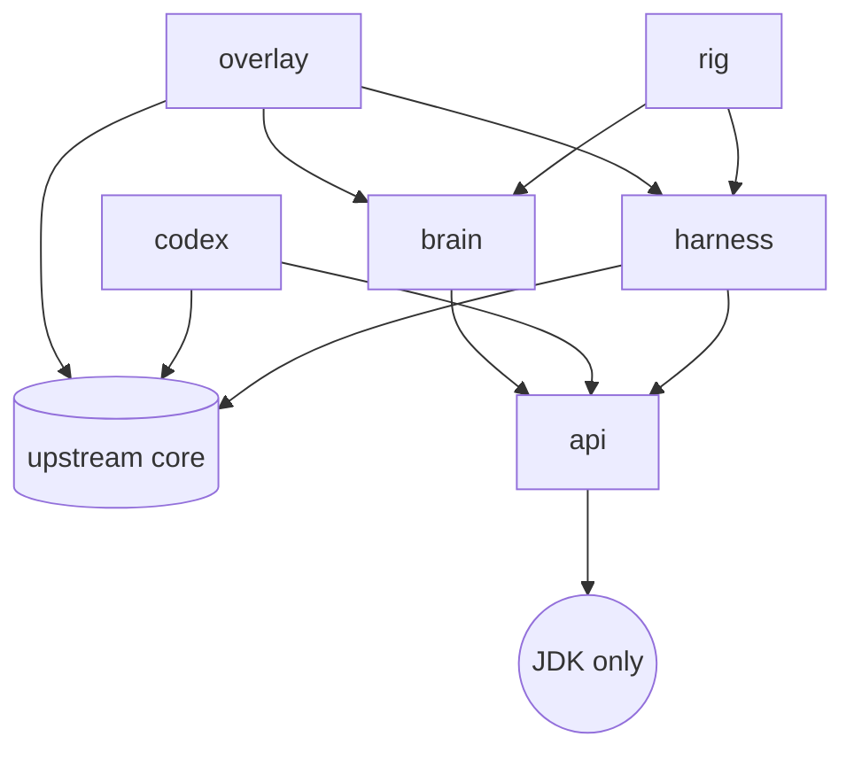

# Architecture

!!! note "Placeholder"
    The BMAD architecture document (bootstrap sessions 11-12) becomes the authoritative
    description once the product owner approves it; this page will then point at it under
    [BMAD artifacts](bmad/index.md) and keep only the module map. Until then the module map
    below and [ADR-0003](adr/0003-module-layout.md) are what exists.

## Modules

Shatterfish adds six Gradle modules beside upstream's, all under `shatterfish/`, package root
`org.shatterfish`. The arrows are the only permitted dependency edges; the build fails on any
other.

| Module | May depend on | Contents |
|---|---|---|
| `api` | nothing | DTOs only: `Observation`, `Action`, `Belief`, `Decision`, run-log records, the `JsonWriter` they share; and ADR-0009's reserved half, `SnapshotHandle`, `RolloutResult`, `BeliefSample`, the `BeliefSampler` interface, and `Simulator` and `Redeterminer`, two abstract classes whose final methods hold the scrubbed contract (story 1.20) |
| `harness` | `core`, `api` | `Observer` (the only class allowed to read game state into the bot), `ActionExecutor` (the only class that drives the hero), RNG control, snapshot/restore, redetermination, `HeadlessBoot` (the backend, the no-op graphics binding, the virtual display `HeadlessGraphics` reports so that text renders, in-memory settings), `HeadlessScene` (the game's own scene, constructed without a graphics context) and `SceneStepper` (one fenced frame at a time), `HeadlessDriver` (owns a Run in `org.shatterfish.harness.driver`: starts a seeded game the way a player does and steps it to each Input wait, a death or a requested scene change), `UiRole` (the thread that observes and executes, claimed by the driver that starts a Run and asserted by the Observer and the executor on entry, story 1.19), `SnapshotStore` (a Run's exact state at a wait, the game's own save held in memory and put back through its own load, handed out as an opaque `SnapshotHandle`, story 1.20), `Launcher` (the harness command line: a seed, `--oracle` and `--benchmark`, the only place an `OracleObserver` is constructed; its nested `Benchmark` measures the E1 numbers and reads the sidecar under `--oracle`, story 1.21), `OracleObserver` and `OracleView` (the marked read and its sidecar, story 1.18), `EmbeddedDriver` |
| `codex` | `core`, `api` | The Codex generator (`Generate`, one task with no Run, ADR-0017): every mob, item, generator table, mob rotation, trap, recipe and changelog entry as `api` records written as canonical JSON to `codex/<tag>/*.json`, each entry cited to the `path:line` read from the pinned source at generation (`Citations`); `CodexSeedFreeTest` and `CodexLeakTest` hold that no value derives from a seed, a Profile or a Run (story 2.1); the vocabulary diff against a second pinned game, read and never built (story 2.8); the site's Codex pages rendered from that same text by the same task (`Pages`, story 2.9), held against the committed folder by the same drift check and against `mkdocs.yml`'s nav by `CodexDocsTest`; the citation checker as E2 adds it. The harness is on its test classpath only, for the leak test's live Run |
| `brain` | `api` only | Beliefs, scripted policies, tactical search, strategic playbooks, evaluation. Identical code runs headless and in the overlay. Since story 4.1: `Brain` (arbitration over a priority list of `Policy`s, re-planned from each Observation), `Memory` (the Belief's bytes: what was seen, never what was intended), `Stream` (the Brain's own SplitMix64 randomness), and `BrainDecider`, the `api` `Deliberator` the Run loop drives and logs the Decision and Belief hash of. The rig names it `shatterfish`. Since story 4.2 it is built on `Codex.Knowledge` (the identifiable families by deck weight, the items special rooms place, the guaranteed drops), which the rig reads from `codex/<tag>/` (`CodexKnowledge`), and `Beliefs` holds what it believes: candidate identities per unidentified appearance, floor facts, the guaranteed drops a set of floors still owes, and enemies remembered out of sight. Since story 4.4: a `Policy` ranks what it would do, and its next ranks are the Decision's alternatives; `Safety` (the Decision's flags, read off the screen); `Highlights` (the cells the chosen Action points at, handed over through `Deliberator.lastHighlights` into the wait record) Since story 4.5: `Evaluation`, one scoring function, a weighted integer sum of features the Observation shows (position features: hit points, depth, level, strength, hunger, enemies in view; action features: resting while hurt, attacking, descending, searching, waiting), with its weights an `api` `Weights` value the rig reads from `weights/<brain>.json` and hands over at construction; the fallback Policy draws uniformly among the offered Actions that score highest Since story 4.6: `Explore`, the first Policy that changes play: one Step per wait toward the nearest frontier over the cells a click steps onto (never a transition, a chest, an armed trap, the chasm or the well), then a bounded round of searches from cells beside a wall, each spot once; `Memory` (version 3) records where the hero has been seen standing still, and each Policy draws from a stream keyed on its name Since story 4.3: `SafeTest`, the worst-case check on trying an unidentified potion, scroll or wand where the hero stands, over the candidate identities, the cell's water, the enemies in view and the hero's hit points; a lethal worst case, or a disabling one beside an enemy, is refused whatever the mean. Since story 4.7: `Fight`, above `Explore` while an enemy is in view: it attacks when the fight is favourable by the Codex's combat figures (`Codex.Threat`, `Codex.Gear`, read by `CodexKnowledge` from `mobs.json`, `combat.json` and `strings.json`), takes the cell fewest enemies can engage when several are coming, and retreats otherwise, by the stairs only while the floor is not sealed Since story 4.8: `Pickup` and `Equip`, below `fight` and above `explore`, which stay out while an enemy is in view: `Pickup` takes an item worth the turns to reach it, reading the Beliefs for an unidentified one, remembers a heap the game would not let it take (`Memory.refused`, read against the pack and its own aim on the screen before) and blocks its own refused Step; `Equip` puts on a plain weapon or armour the Evaluation prefers, after the strength it asks and a hidden curse's chance, never one whose worst case `SafeTest` calls unsurvivable, matching names with the fight Policy's `Fight.measured`, on the Codex's gear (`Codex.Gear` with the item table's tier and strength) and the Evaluation's item, gold, turn, weapon, armour and curse weights. Since story 4.9: `Heal`, above `Fight`, drinks an identified potion of healing when the hero's hit points are at or under the damage the enemies in view are expected to deal before the fight is over (the fight Policy's threat estimate), one potion at a time (`Memory` version 5 records the wait of the last drink); `Eat`, below `Fight` and above `Explore`, on calm screens eats at the hungry icon a food of at most 300 energy and at the starving icon the food that wastes least, from a cited table of food energies by shown name, and the fallback never eats Since story 4.10: `TestItem`, the first Policy on a calm screen: it drinks or reads the unidentified potion or scroll worth most to know (copies held times candidates left), a potion only at half health or below when healing holds at least a fifth of its odds and its worst case leaves a quarter of the hit points, walking up to eight Steps first to a cell that makes the worst case smaller (water against liquid flame, a door with a way through against toxic gas); a scroll only at full health and while the item-picker scrolls hold under a quarter of its odds, read plainly; for twelve waits after a test it steps out of its own fire or gas, through the credited door, and then rests toward full health; a test the next screen shows was not carried out is balked at for the floor. `Memory` version 7 adds `drank` (story 4.9) and `trial`, `balked`, `walking`, `tested`, `clouds` and `refuge`: the clouds are the cells seen showing fire or a harmful gas, which `Explore.walkable` keeps every walking Policy off until they are seen clear. Answer-prompt declines item confirmations but the scroll's cancel. The fallback no longer draws item uses while anything else is offered. Since story 4.12: `Descend`, between equip and explore, owns the way down: it leaves a floor when it is spent (`Explore.spent`: no reachable frontier and no search worth making), when the hero is hungry with no food held, or when the waits on the floor reach an allowance of 500 waits and 250 more per guaranteed drop still expected on it (owed in the set, over the floors left in it); it walks to the cell beside the open regular exit, rests there to full health unless starving (at most 20 rests a floor), then takes the Step onto the exit, which travels; never on a sealed floor. With no exit seen it searches on past explore's budget. It stands aside for explore's owed rest and its step out of an avoided region. The fight Policy's retreat never flees down onto a boss floor, nor down hurt while the descend Policy is leaving. The explore Policy no longer descends. `Memory` version 8 adds `arrived`, `rests`, `stepped` (the cell of the last Step handed over), `tried` and `fleeting`: two refusals aimed at one cell block it, for the floor on a calm screen and for 100 waits with an enemy in view, and no refusal counts while the hero shows rooted or vertigo; while rooted the Brain offers itself no Step and no stairs. |
| `rig` | `harness`, `brain`, `api` | Parallel runner, statistics, SPRT, JSONL run logs, replay; the five committed Seed sets and the one task that writes them (`SeedSets`, `Seeds`, one command with no Run, ADR-0018): every triple derived from the set's own name and the triple's index through the published mix function, so a stranger can reproduce a set rather than download it, and `SeedSetsTest` holds the committed bytes against a fresh derivation. `load` refuses the `holdout` set to a development read and `publish` takes the reason it is being opened (FR-20) |
| `overlay` | `core`, `harness`, `brain` | The in-game UI and `ShatterfishLauncher` |

## Invariants that will not change

- The brain re-plans from the current `Observation` every turn and never assumes it made the
  previous move. This is what makes human takeover in the overlay work without desync.
- Search never sees hidden state: either an abstract tactical model built from the Observation
  and beliefs, or engine rollouts with redetermination (re-sample everything hidden before each
  rollout). Rollouts on the raw saved game are forbidden.
- A run is fully determined by (upstream tag, seed, action list).
- The overlay uses the game's own toolkit only.

See [Fairness](fairness.md) for how the first two are tested and [Glossary](glossary.md) for the
terms.
